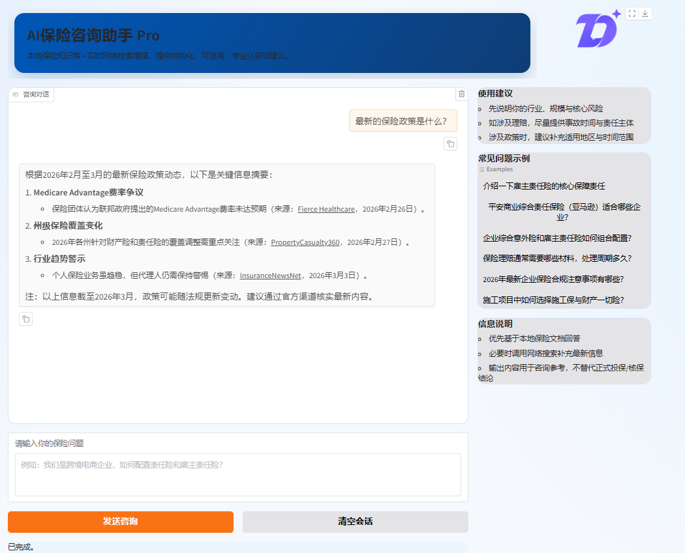

# AI 保险问询助手 - 项目文档



## 📋 项目概述

这是一个基于大型语言模型（LLM）和检索增强生成（RAG）技术的 **AI 保险问询助手**系统。项目通过多个迭代版本的演进，最终形成了一个专业、高效、可扩展的保险知识咨询平台。

### 核心能力

- 🔍 **本地知识库检索**：通过 Elasticsearch 进行高效的向量检索
- 🌐 **实时网络搜索**：集成 Tavily 搜索引擎获取最新信息
- 💬 **多轮对话**：支持上下文对话和多轮交互
- 🎨 **专业UI界面**：提供 Web 和终端两种交互方式
- 🛠️ **灵活工具集成**：支持代码执行、图像生成等扩展工具

---

## 🚀 版本演进史

### v1 - 基础版（aibot-v1-basic.py）

**发布时间**：初期版本**功能特点**：

- ✅ 基础 RAG 检索
- ✅ 本地文档加载和索引
- ✅ Web UI + 终端模式
- ✅ 自定义工具集成（图像生成）
- ❌ 仅支持本地文档检索

**使用场景**：简单的本地知识库咨询

**启动方式**：

```bash
python aibot-v1-basic.py --mode gui      # Web 界面
python aibot-v1-basic.py --mode terminal  # 终端模式
```

---

### v2 - Elasticsearch 增强版（aibot-v2-elasticsearch.py）

**发布时间**：第二个迭代**改进亮点**：

- ✅ 集成 Elasticsearch 作为专业向量数据库
- ✅ 支持高效的大规模文档检索
- ✅ HTTPS + 身份认证支持
- ✅ 自动索引管理和统计信息
- ✅ 优化的检索性能

**核心改进**：

- 从内存 RAG 升级到 Elasticsearch 分布式检索
- 支持企业级的安全认证机制
- 提供索引统计和性能监控

**使用场景**：企业级本地知识库管理

**启动方式**：

```bash
# 初始化并预加载文档
python aibot-v2-elasticsearch.py --init-es

# 启动应用
python aibot-v2-elasticsearch.py --mode gui      # Web 界面
python aibot-v2-elasticsearch.py --mode terminal  # 终端模式
```

**Elasticsearch 配置**：

```python
rag_cfg = {
    'use_elasticsearch': True,
    'es_hosts': ['localhost:9200'],
    'es_index': 'insurance_knowledge',
    'es_username': 'elastic',
    'es_password': 'your_password',
    'use_https': True,
    'verify_certs': False,
}
```

---

### v3 - 增强版（aibot-v3-enhanced.py）

**发布时间**：第三个迭代**核心升级**：

- ✅ 集成 Tavily 网络搜索引擎
- ✅ 双源信息融合（本地 + 网络）
- ✅ 智能信息来源标注
- ✅ 专业系统提示词设计
- ✅ 完善的初始化检查流程

**架构改进**：

```
用户查询
    ↓
├─→ 本地知识库 (Elasticsearch)
│   └─→ 高精度的保险条款信息
│
├─→ 网络搜索 (Tavily)
│   └─→ 最新政策、实时新闻、行业动态
│
└─→ 智能融合
    └─→ 标注来源 + 可追溯回答
```

**主要特性**：

- 智能选择检索源
- 优先级管理（本地 > 网络）
- 时效性提示和不确定性说明
- 详细的初始化日志

**使用场景**：需要最新保险信息和政策的专业咨询

**启动方式**：

```bash
# 环境变量配置
set DASHSCOPE_API_KEY=your_dashscope_key
set TAVILY_API_KEY=your_tavily_key

# 启动应用
python aibot-v3-enhanced.py --mode gui      # Web 界面
python aibot-v3-enhanced.py --mode terminal  # 终端模式
python aibot-v3-enhanced.py --init-es       # 初始化 Elasticsearch
```

---

### v4 - Gradio 专业版（aibot-v4-gradio.py）

**发布时间**：最新版本**UI/UX 升级**：

- ✅ 自定义 Gradio 界面设计
- ✅ 专业的品牌配色和布局
- ✅ 实时状态显示
- ✅ 建议问题快速启动
- ✅ Docker 自动降级处理

**界面特点**：

```
┌────────────────────────────────────┐
│     AI保险咨询助手 Pro              │
│   本地知识库 + 实时网络检索增强    │
└────────────────────────────────────┘
┌─────────────────────┬──────────────┐
│   主对话区域        │   侧边栏     │
│                     │  • 使用建议  │
│   [聊天记录]        │  • 示例问题  │
│   输入框            │  • 信息说明  │
│   [发送] [清空]     │              │
└─────────────────────┴──────────────┘
```

**核心优化**：

- 流式响应处理（实时显示进度）
- 工具调用隐藏（清晰的用户界面）
- Docker 可用性自动检测
- 端口自动适配

**使用场景**：生产环境专业应用，重视用户体验

**启动方式**：

```bash
# GUI 模式（推荐）
python aibot-v4-gradio.py --mode gui

# 指定端口
python aibot-v4-gradio.py --mode gui --server-port 8080

# 终端模式
python aibot-v4-gradio.py --mode terminal

# 初始化时使用
python aibot-v4-gradio.py --mode gui --init-es
```

---

## 📊 版本对比表

| 功能特性      | v1 基础版 | v2 ES版 | v3 增强版 | v4 Pro版 |
| ------------- | --------- | ------- | --------- | -------- |
| 本地RAG检索   | ✅        | ✅      | ✅        | ✅       |
| Elasticsearch | ❌        | ✅      | ✅        | ✅       |
| 网络搜索      | ❌        | ❌      | ✅        | ✅       |
| 企业级安全    | ❌        | ✅      | ✅        | ✅       |
| 自定义UI      | ❌        | ❌      | ❌        | ✅       |
| 状态监控      | ❌        | ✅      | ✅        | ✅       |
| 代码执行      | ✅        | ✅      | ✅        | ✅       |
| 图像生成      | ✅        | ✅      | ✅        | ✅       |
| 流式响应      | ❌        | ❌      | ❌        | ✅       |
| Docker支持    | ❌        | ❌      | ❌        | ✅       |

---

## 🔧 环境配置

### 必需服务

#### 1. Elasticsearch（推荐）

用于存储和检索保险文档的向量数据库。

```bash
# Docker 方式启动（推荐）
docker run -d \
  -p 9200:9200 \
  -e discovery.type=single-node \
  -e xpack.security.enabled=true \
  -e ELASTIC_PASSWORD=your_password \
  docker.elastic.co/elasticsearch/elasticsearch:8.x.x
```

配置信息：

- 地址：`localhost:9200`
- 用户名：`elastic`
- 密码：`your_password`
- HTTPS：启用

#### 2. Python 环境

```bash
# 创建虚拟环境
python -m venv venv
source venv/Scripts/activate  # Windows: venv\Scripts\activate

# 安装依赖
pip install qwen-agent
pip install elasticsearch
pip install python-dotenv
pip install gradio
pip install requests
```

### API Key 配置

创建 `.env` 文件：

```env
# 必需：阿里云 DashScope API
DASHSCOPE_API_KEY=your_dashscope_api_key

# 可选：Tavily 网络搜索
TAVILY_API_KEY=your_tavily_api_key
```

或者直接设置环境变量：

```bash
# Windows PowerShell
$env:DASHSCOPE_API_KEY = "your_key"
$env:TAVILY_API_KEY = "your_key"

# Linux/Mac
export DASHSCOPE_API_KEY="your_key"
export TAVILY_API_KEY="your_key"
```

---

## 🎯 快速开始

### 第一步：准备文档

在项目根目录创建 `docs` 文件夹，放入保险文档（txt/pdf等）：

```
insurance-qa-system/
├── docs/
│   ├── 1-平安商业综合责任保险.txt
│   ├── 2-雇主责任险.txt
│   └── 3-企业团体综合意外险.txt
├── versions/
│   ├── aibot-v1-basic.py
│   ├── aibot-v2-elasticsearch.py
│   ├── aibot-v3-enhanced.py
│   └── aibot-v4-gradio.py
└── README.md
```

### 第二步：启动服务（以v4为例）

```bash
# 进入项目目录
cd insurance-qa-system

# 初始化索引（首次运行）
python versions/aibot-v4-gradio.py --init-es

# 启动 Web 界面
python versions/aibot-v4-gradio.py --mode gui
```

### 第三步：访问应用

打开浏览器访问：`http://localhost:7860`

---

## 💡 功能详解

### 1. 本地知识库检索

- 自动加载 `docs/` 目录下的所有文档
- 支持 TXT、PDF 等多种格式
- 自动分块和向量化
- 高效的相似度检索

### 2. 网络搜索（v3+）

通过 Tavily 搜索引擎补充最新信息：

- 最新保险政策和法规
- 实时产品信息
- 行业新闻和动态
- 用户评价和口碑

自动标注来源和发布时间。

### 3. 多轮对话

支持完整的对话历史管理：

```python
messages = [
    {'role': 'user', 'content': '第一个问题'},
    {'role': 'assistant', 'content': '第一个回答'},
    {'role': 'user', 'content': '第二个问题'},
    {'role': 'assistant', 'content': '第二个回答'},
]
```

### 4. 工具扩展

#### 图像生成工具

```python
# 自动调用，生成保险相关的图表或插图
"绘制一份保险责任对比表"
```

#### 代码执行工具

```python
# 进行数据分析或复杂计算
"计算一份保险的平均理赔周期"
```

#### 网络搜索工具（v3+）

```python
# 查询最新信息
"搜索2024年企业保险新政策"
```

---

## ❓ 常见问题

### Q1：如何添加新的保险文档？

**A**：将文档放在 `docs/` 目录下，然后重新启动应用并使用 `--init-es` 参数：

```bash
python versions/aibot-v4-gradio.py --init-es --mode gui
```

### Q2：Elasticsearch 连接失败怎么办？

**A**：检查以下几点：

1. Elasticsearch 服务是否正在运行
2. 连接地址是否正确（默认 localhost:9200）
3. 用户名密码是否正确
4. 如果使用 HTTPS，检查证书配置

```bash
# 测试连接
curl -u elastic:password https://localhost:9200 --insecure
```

### Q3：如何离线使用（不需要网络搜索）？

**A**：使用 v2 版本或禁用 Tavily 工具：

```bash
# 编辑代码，修改 tools 列表
tools = ['my_image_gen', 'code_interpreter']  # 移除 'tavily_search'
```

### Q4：如何提高检索准确性？

**A**：

1. 确保文档质量和完整性
2. 调整 RAG 配置参数：
   ```python
   rag_cfg = {
       'max_ref_token': 4000,         # 增加可提升准确性
       'parser_page_size': 500,       # 调整分块大小
       'rag_keygen_strategy': '...',  # 调整关键词生成策略
   }
   ```
3. 使用更好的 LLM 模型

### Q5：如何在生产环境部署？

**A**：建议使用 v4 版本，并进行以下优化：

1. 配置 Nginx 反向代理
2. 使用 Gunicorn 运行 Gradio
3. 配置 SSL/TLS 证书
4. 设置请求限流和身份认证

示例 Nginx 配置：

```nginx
server {
    listen 443 ssl;
    server_name your-domain.com;
  
    ssl_certificate /path/to/cert.pem;
    ssl_certificate_key /path/to/key.pem;
  
    location / {
        proxy_pass http://localhost:7860;
        proxy_set_header Host $host;
        proxy_set_header X-Real-IP $remote_addr;
    }
}
```

### Q6：如何自定义系统提示词？

**A**：编辑各版本中的 `system_instruction` 变量：

```python
system_instruction = '''你是一个专业的保险顾问...
在回答问题时，你应该...
'''
```

---

## 📈 性能优化建议

### 1. Elasticsearch 优化

```python
# 增加内存
elasticsearch.yml:
  bootstrap.memory_lock: true
  ES_JAVA_OPTS: -Xms4g -Xmx4g

# 增加字段数
  indices.mapping.total_fields.limit: 2000
```

### 2. 检索优化

```python
rag_cfg = {
    'max_ref_token': 6000,         # 增加更多参考文本
    'top_k': 5,                     # 增加返回结果数
    'similarity_threshold': 0.5,   # 调整相似度阈值
}
```

### 3. LLM 调用优化

```python
llm_cfg = {
    'temperature': 0.3,             # 降低温度提高准确性
    'top_p': 0.8,                   # 调整采样参数
    'max_tokens': 2000,             # 限制输出长度
}
```

---

## 🔐 安全建议

1. **API Key 管理**

   - 不要在代码中硬编码 API Key
   - 使用 `.env` 文件并添加到 `.gitignore`
   - 定期轮换密钥
2. **Elasticsearch 安全**

   - 启用身份认证
   - 使用 HTTPS 加密传输
   - 限制网络访问范围
3. **应用安全**

   - 启用 HTTPS
   - 添加请求认证
   - 实施请求限流
   - 记录审计日志

---

## 📞 支持与联系

如有问题或建议，请：

1. 检查文档中的常见问题
2. 查看项目的初始化日志输出
3. 测试各组件的连接状态
4. 提交 Issue 或联系开发团队

---

## 📝 版本更新日志

### v4 Gradio 专业版

- ✨ 自定义 UI 界面设计
- 🔧 Docker 自动降级处理
- 🚀 流式响应优化
- 🎨 专业品牌配色

### v3 增强版

- ✨ Tavily 网络搜索集成
- 📊 双源信息融合
- 🏷️ 智能来源标注
- 🔍 专业系统提示词

### v2 Elasticsearch 版

- ✨ 企业级向量数据库
- 🔐 HTTPS + 身份认证
- 📈 性能优化
- 🛠️ 索引管理工具

### v1 基础版

- ✨ 基础 RAG 检索
- 💬 多轮对话支持
- 🎨 Web UI + 终端模式
- 🔧 工具扩展框架

---

## 📄 许可证

本项目遵循 MIT 许可证。详见 LICENSE 文件。

---

**最后更新**：2026 年 5 月
**项目版本**：4.0 Gradio Pro
**状态**：生产就绪 ✅
